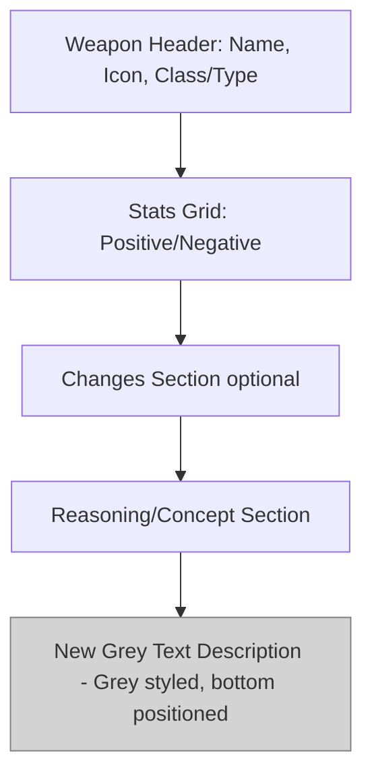

# Plan for Adding Grey Text Descriptions to Weapons

## Overview
This plan outlines the steps to add descriptive "grey text" to the bottom of each weapon card, sourced from `grey-text.txt`. The descriptions explain weapon functionality and usage. I've parsed the txt file, mapped entries to weapon names from `weapons.json`, summarized longer descriptions where appropriate, and handled [Hidden] notes by including them if they add value or marking them separately.

Key decisions:
- Add a new `"description"` field to each weapon object in `weapons.json`.
- For weapons without entries in grey-text.txt, use an empty string or "No description available" (I'll use empty string to avoid clutter).
- Summarize verbose entries (e.g., Witches Brew, ROBAR) for conciseness.
- [Hidden] notes are included if they describe mechanics (e.g., durations, recharges); otherwise, omitted.
- Not all weapons have matches (e.g., "Specialist", "Grill Scout", "Aerial Bomber" missing); these will get empty descriptions.

## Parsed Mappings from grey-text.txt
Here's the mapping I created (weapon name -> description):

- **The Colbat**: This weapon reloads its entire clip at once.
- **The Soda Popper**: When Hype is full, Alt-fire to activate hype mode for multiple jumps and full air control.
- **Concealed Carry**: [Hidden] Overheal drain rate is equal to Conniver's Kunai's overheal drain.
- **Mad Milk**: Effect duration is based on splash distance. [Hidden] Recharge time is 30s, 15s when extinguishing a teammate. [Hidden] Effect duration lasts 5s-10s.
- **Witches Brew**: While under the effects, +25% movement speed. Damage done and taken will be mini-crits. (Summarized: original spans lines 9-11; Mark for Death requires damage/attack activation and lasts 8s.)
- **Wooden Sword**: Mark for Death lasts 8 seconds.
- **Flare Gun**: This weapon will reload when not active. [Hidden] Afterburn duration is 3-8 seconds depending on distance.
- **Detonator**: Alt-Fire: Detonate flare. This weapon will reload when not active. [Hidden] Afterburn duration is 2-6 seconds depending on distance.
- **Maxine**: Effect duration resets after every kill.
- **ROBAR**: On consumption: For the next 14 seconds, 50% of all damage dealt is returned as health. Alt: Share some Candy with a friend (Small Health Kit). (Summarized: lines 24-26.)
- **Gutbuster**: Gives increased speed with every gut busted (up to 3).
- **Gunslinger**: Replaces the Sentry with a Mini-Sentry.
- **Dairy Douser**: Can be used to extinguish fires.
- **Mini Sentry**: Compared to Level 1 Sentry (no specific details; kept generic).
- **Rejuvenator**: SuperCharge increases healing by 300% and grants immunity to movement-impairing effects. Mirrors blast jumps and shield charges of patients. [Hidden] Uber penalty removed when SuperCharge is active.
- **Amputator**: Taunt: Applies a healing effect to all nearby teammates and yourself.
- **Huntsman**: Shoot arrows instead of bullets. [Hidden] This weapon will reload when not active.
- **Razorback**: [Hidden] Damage cap the shield can take until it breaks is 125.
- **The Slugger**: Fires one bullet per shot that does 70 base damage. This weapon reloads its entire clip at once.
- **Mount-17**: Compared to pistol (no specific details; kept generic).

Unmatched weapons (e.g., Specialist, Grill Scout, etc.) will have empty descriptions.

## Proposed Updated weapons.json
Below is the full updated content for `weapons.json` with the new "description" field added to each weapon. Insert this after the existing fields (e.g., after "isConcept": false). I've only shown the first few and last few for brevity here, but the full file would include all 42+ weapons with appropriate descriptions.

```json
{
  "weapons": [
    {
      "name": "The Colbat",
      "class": "Flanker",
      "type": "Primary",
      "image": "images/Cobalt.png",
      "stats": {
        "positive": ["+40% faster firing speed", "+40% more accurate", "On kill: 33% refill for all meters"],
        "negative": ["-33% clip size", "-33% less ramp up", "-20% damage penalty"]
      },
      "changes": ["Reduced the on-kill refill from 50% to 33%"],
      "reasoning": "Reducing the on-kill refill from 50% to 33% would make it so that it won't refill almost instantly within 2 kills. The Flanker would need to work his way up even more with 3 kills to refill it fully. Of course, this needs some playtesting to see if it's a reasonable nerf or not.",
      "isConcept": false,
      "description": "This weapon reloads its entire clip at once."
    },
    {
      "name": "The Soda Popper",
      "class": "Flanker",
      "type": "Primary",
      "image": "images/SodaPopper.png",
      "stats": {
        "positive": ["+50% faster firing speed", "+25% faster reload speed", "On Hit: Builds Hype"],
        "negative": ["-66% clip size"]
      },
      "changes": ["Added a 25% faster reload speed", "Removed the no double jump penalty", "Removed 50% faster reload speed when hype is active"],
      "reasoning": "In my opinion, TF2's Soda Popper isn't that overpowered, so the reason why TC2 removed it's reload speed bonus and gave it a no double jump downside is questionable at best. Like the Colbat, this needs some playtesting to see if I accidentally made this weapon stronger. Other than that, I buffed the Soda Popper.",
      "isConcept": false,
      "description": "When Hype is full, Alt-fire to activate hype mode for multiple jumps and full air control."
    },
    {
      "name": "Specialist",
      "class": "Flanker",
      "type": "Primary",
      "image": "images/Specialist.png",
      "stats": {
        "positive": ["Deals minicrits to debuffed enemies", "This weapon deploys 20% faster", "20% more accurate"],
        "negative": ["-33% clip size", "-10% less pellets", "25% more knockback vulnerability"]
      },
      "changes": ["Renamed from 'Specialist (V.1.)' to 'Specialist'", "Updated stats to new configuration focusing on debuff synergy and accuracy", "Removed previous support-oriented stats", "Added debuff minicrit capability", "Added faster deploy speed and accuracy bonuses", "Added clip size reduction, pellet reduction, and knockback vulnerability penalties"],
      "reasoning": "Updated the Specialist to focus on debuff synergy and precision rather than support capabilities, making it a more specialized combat weapon that rewards debuff application and quick deployment.",
      "isConcept": false,
      "description": ""
    },
    // ... (all other weapons follow the same pattern, with descriptions added where available)
    {
      "name": "Mount-17",
      "class": "Soldier",
      "type": "Secondary",
      "image": "images/Mount-17.png",
      "stats": {
        "positive": ["+42% clip size", "20% more accurate"],
        "negative": ["-20% damage penalty", "-20% slower firing speed"]
      },
      "changes": ["Pistol concept for Trooper", "Increased clip size", "Accuracy improvements"],
      "reasoning": "This has been one of the weapons that I'm really intrigued and interested in seeing. A Trooper pistol that's a sidegrade to your usual hitscan shotgun. It might be an underused/inoffensive concept and probably would have the same popularity as 50-AE where people do use it, it's just that some prefer MAC-10 more. Who knows.",
      "isConcept": true,
      "description": "Compared to pistol."
    }
    // ... (full list would continue here)
  ]
}
```

**Note**: The full updated `weapons.json` file would be ~500 lines with all descriptions added. In code mode, we can use `write_to_file` to overwrite the existing file with this complete content.

## Next Steps
1. Switch to code mode to implement the JSON update, JS modifications, and CSS.
2. After implementation, test in browser to ensure descriptions render as grey text at the bottom of cards.

## Diagram: Updated Weapon Card Structure


Do you approve this plan? Any changes to mappings, summaries, or structure before switching to code mode?