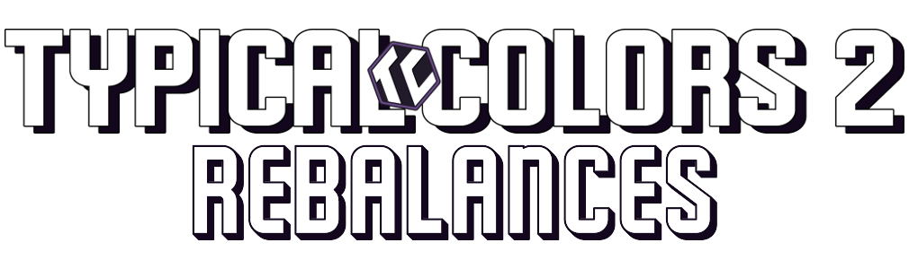

# Typical Colors 2 - Weapon Rebalances

## Welcome to the Typical Colors 2 Wiki

This wiki contains community weapon rebalancing proposals to improve game balance and weapon viability across all classes in Typical Colors 2. Featuring reworked stats, new mechanics, and quality of life improvements.

### ⚠️ Important Disclaimer

**This is an unofficial fan-made wiki created for entertainment and discussion purposes only.** We are not affiliated with Dorcus or Typical Colors in any way. We do not expect or want these changes to be officially implemented, and we do not seek acknowledgment from the developers. This is purely for fun and community discussion.

## Quick Navigation

- **[Classes](classes/Classes)** - Overview of all playable classes
- **[Weapons](weapons/Weapons)** - Complete list of weapon rebalances and concepts
- **[Contributing](guides/Contributing)** - How to add your own weapon ideas
- **[FAQ](guides/FAQ)** - Frequently asked questions
- **[Changelog](guides/Changelog)** - Latest updates and changes

## Featured Content

### 🎨 Workshop Items
Check out the latest cosmetic reskins and weapon appearances from our community workshop.

### 🗺️ Map Updates
Suggested map reworks and new gameplay areas (Coming Soon)

### ⚖️ Balance Changes
Latest weapon rebalances and gameplay improvements.

### 💡 New Ideas
Innovative weapon concepts pushing the boundaries of gameplay.

## Recent Updates

- **Major Rebalances**: Improved mobility and sustain for Flanker weapons, enhanced projectile performance for Trooper weapons, better afterburn mechanics for Arsonist weapons, balanced damage and mobility for Brute weapons.
- **Quality of Life**: Faster reload times, improved visual feedback, better weapon descriptions.
- **Balance Adjustments**: Reduced overpowered mechanics, buffed underperforming weapons, improved counterplay opportunities.

## Join the Discussion

Have questions or want to contribute? Join our Discord community:

---

*Last updated: 2025-09-04* | *Maintained by the TC2 Community*